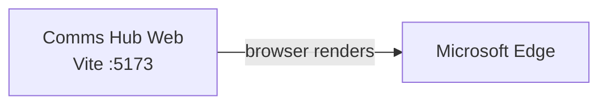

# Azure Debug Plan

> This plan is the source of truth for generating the
> VS Code debug setup in this workspace.
>
> **Status:** Implemented
> **Execution Mode:** Auto
> **Created:** 2026-09-19T00:42:52-04:00
> **Last Updated:** 2026-09-19T00:45:11-04:00

## Prerequisites

| Tool / Extension | Category | Service(s) | Installed | Version |
|------------------|----------|------------|-----------|---------|
| Node.js | Runtime | comms-hub-web | ❓ | Could not be confirmed by the current shell probe |
| npm | Package manager | comms-hub-web | ❓ | Could not be confirmed by the current shell probe |
| Edge | Browser / Debug | comms-hub-web | ✅ | 153.0.4234.46 |
| JavaScript Debugger | VS Code debug extension | comms-hub-web | ✅ | Built-in |

> ⚠️ **Action required:** Confirm any tool marked ❓ is installed and ready before running the local app. The current shell could not resolve Node.js, npm, Docker, or Podman.

## Debug Configurations

| Generate | Debug Config Name | Service Label | Service Root | Project Type | Runtime | Version | Azure Dependencies |
|----------|--------------------|---------------|--------------|--------------|---------|---------|---------------------|
| [x] | Comms Hub Web (debug) | Comms Hub Web | ./ | frontend-spa | node-js | — | — |

ℹ️ Project Type Descriptions

| Project Type | Description |
|-------------|-------------|
| frontend-spa | Single-page application served by a Vite development server. |

## Orchestrator

| Orchestrator | Container Runtime | Compose Command | Description |
|-------------|-------------------|-----------------|-------------|
| Docker Compose | Docker | `docker compose` | Default compose provider; no emulator containers are required for this client-only application. |

## Emulators

| Dependent Service | Emulator | Purpose |
|-------------------|----------|---------|
| None | None | The application stores form state and selected attachments in the browser and has no Azure service dependency. |

## Architecture Diagram

During debugging, VS Code launches the Vite development server for the React SPA and opens it in Edge; all application state remains client-side.

## Debug Configuration Checklist

Debug Configuration Checklist:
❌ Comms Hub Web (debug) — VS Code JSON and launch-to-task wiring validated; Vite ready signal and HTTP verification could not run because Node.js/npm are unavailable in the validation environment.

## Convenience Scripts

| Generate | Script | Registered In | Description |
|----------|--------|---------------|-------------|
| [ ] | emulators:start | ./package.json | No Azure emulators are required. |
| [ ] | emulators:stop | ./package.json | No Azure emulators are required. |
